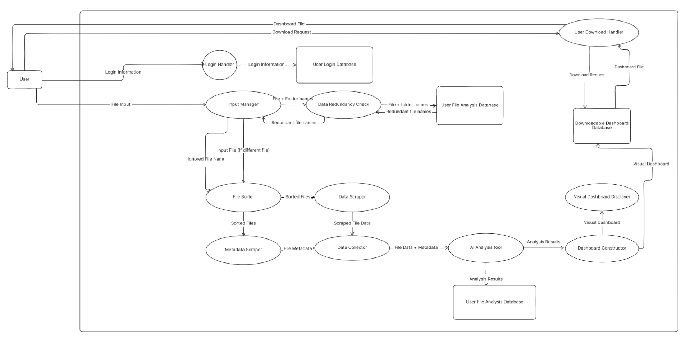

# Data Flow Diagram

### Explanation

- The user will begin by logging in, where they pass thier login information to the system, which verifies it and grants access.

- The user will upload a file which is directed by the input manager towards the file sorting system. It will also check against the users past uploads to see if these files have already been uploaded, in which case the system can confirm with the user if they want to re-analyze their files. 

- The files are then scraped for their metadata and data, and are then collected together to be sent to an analysis tool (Most likely AI). 

- The analysis tool returns a neatly structured file, which is then dissected by a dashboard builder which parses the statistics and descriptions into a visually appealing dashboard. 

- The data used to make the dashboard is stored in a database, so the user can come back and access it whenever they want. 

- The user decides they want their file, so they make a request to the system and since we have all of the data from our dashboard, we can simply send them the dahsboard. 