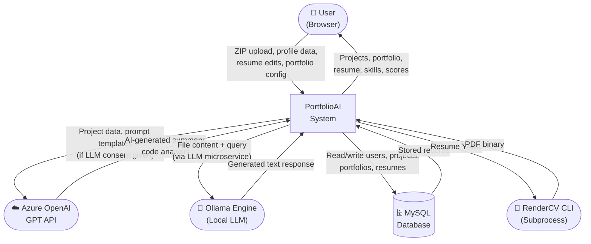
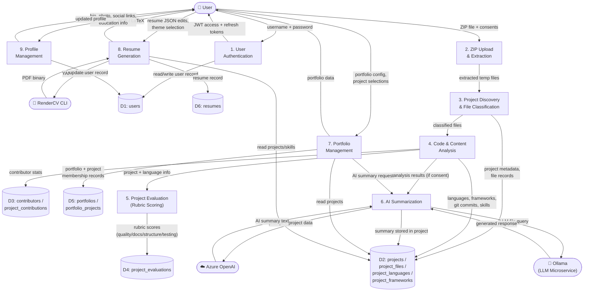
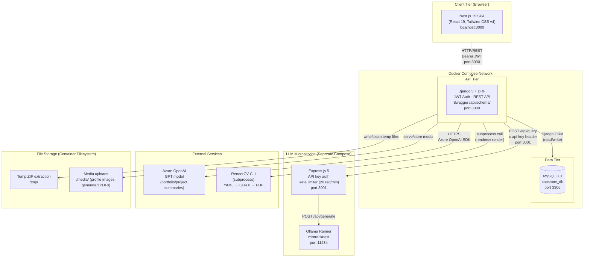

# Dataflow & System Architecture Diagrams

--- 

This is the layout for our diagrams

## Level 0 DFD — Context Diagram

The system is treated as a single process. External entities interact with the **PortfolioAI** system.

---

## Level 1 DFD

The system is decomposed into its major processes and the data stores they interact with.

---

## System Architecture Diagram

Shows the deployment layers, containers, and inter-service communication.

---

### Key Data Stores Summary

| Store | Contents |
|---|---|
| `users` | Credentials, profile, education, social links |
| `projects` | Type, stats, AI summary, LLM consent flag, git metadata |
| `project_files` | Individual file records: type, hash, language, line count |
| `project_languages` | M2M: project ↔ language with file count, primary flag |
| `project_frameworks` | M2M: project ↔ framework with detection method |
| `contributors` / `project_contributions` | Git authors, commit counts, lines added/deleted, % ownership |
| `project_evaluations` | Rubric scores per language: quality, docs, structure, testing (0–100) |
| `portfolios` / `portfolio_projects` | Named collections, ordering, featured flags, cached stats, public slug |
| `resumes` | JSON resume content, RenderCV YAML, theme selection |
