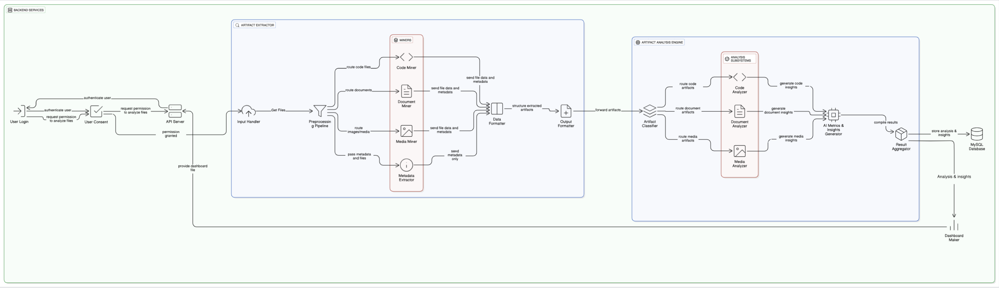

# System Architecture Diagram

## Explanation

In our sysetm architecture we are dealing with a few major components at a few major steps.

### Frontend

Next.JS as you may see in the diagram, but for now we are focused on backend architecture.

### Input Handling

We are worried about recieving files and user permissions and processing them. The system shall accept and handle these inputs by routing them to the appropriate process. 

### Miners (Data Scraping)

Separating the files allows us to use seperate methods for extracting data and metadata depending on file type. 

### Data Formatter (Recompilation)

After getting the data out from the files, we need to send the data through to the next step, so we get it together and then organize it to continue the process.

### Artifact Classifier (File Routing)

Must use the proper method to analyze the file depending on what the file is. This step separates files to their own route.

### Analysis Tool

For better and faster results, we will need to read and determine what kind of project we are analyzing before using an AI anaysis tool. So before sending it through the AI, we run a file structure/distribution alaysis. Our files are analyzed individually and the compiled results are analyzed as a group to give insight before moving on in the process.

### AI Tool

Accepts input from previous analysis with the information gained from it, and the AI tool generates an analysis of the project and the users contributions. This tool is especially useful for its versatility in terms of what it can analyze (drawings, code, writing), and what it can produce (project summary, key concepts, etc.).

### Result Aggregator

We will receive a formatted output from the AI, so we will need to read and understand the results. Specifically, we will be able to route the relevant data to a dashboard making function, which turns the input into a visual display. We will also save this data for the user to access later.

### Dashboard Maker

Noted in the last point, our dashboard maker will receive the analysis results as an input and create a visual dashboard.